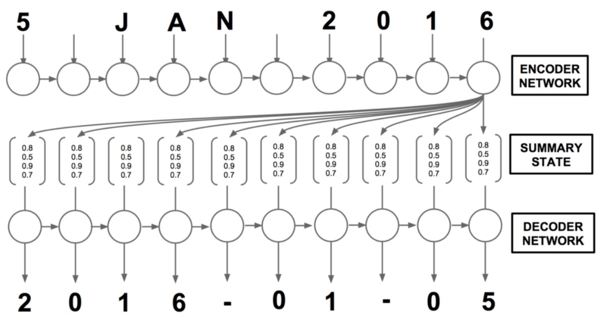
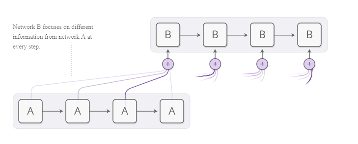
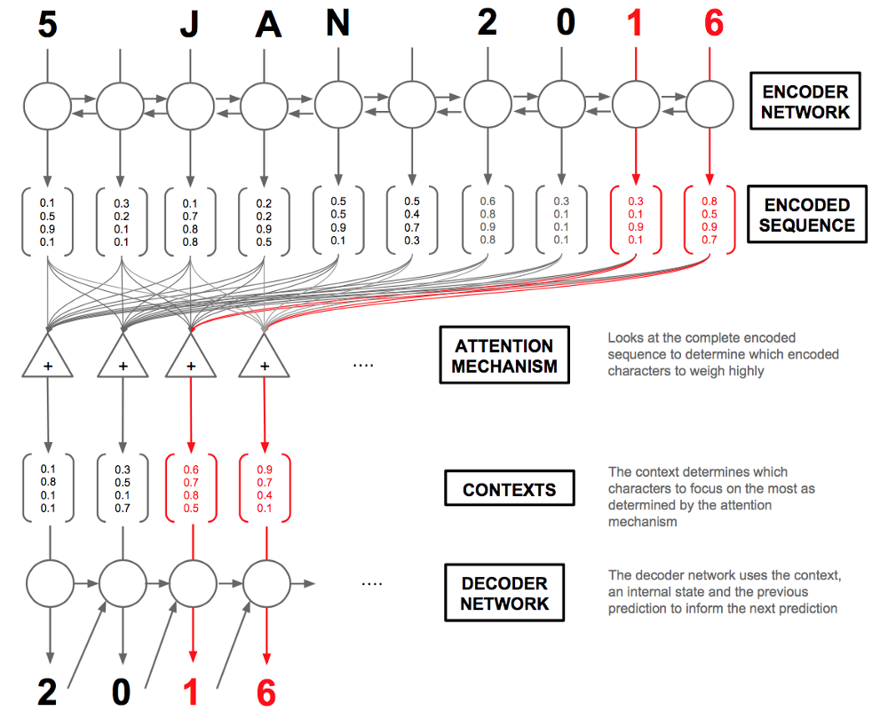

# Attention

Attention model taken from [Zafaralli Ahmed](https://github.com/datalogue/keras-attention) in blog post [How to Visualize Your Recurrent Neural Network with Attention in Keras](https://medium.com/datalogue/attention-in-keras-1892773a4f22). 

Sequence to sequence or Seq2Seq is a neural network that transforms a given sequence, like words or time series, into another sequence. **Seq2seq models consist of an Encoder and Decoder, the Encoder takes the input sequence and maps it into a higher dimensional space.** The n-dimensional vector is taken by the Decoder and turned into an output sequence. The output sequence can be in another language, can be a symbol, etc.

A very basic choice for the Encoder and the Decoder of the Seq2Seq model is a single LSTM for each of them.

## What’s Wrong with Seq2Seq Model?

Broadly speaking, it aims to transform an input sequence (source) to a new one (target) and both sequences can be of arbitrary lengths.

The seq2seq model normally has an encoder-decoder architecture, composed of:

- An encoder processes the input sequence and compresses the information into a context vector (also known as sentence **embedding** or “thought” vector) of a fixed length. This representation is expected to be a good summary of the meaning of the whole source sequence.
- A decoder is initialized with the context vector to emit the transformed output. The early work only used the last state of the encoder network as the decoder initial state.

Both the encoder and decoder are recurrent neural networks, i.e. using LSTM or GRU units.

A critical and apparent disadvantage of this fixed-length context vector design is incapability of remembering long sentences. Often it has forgotten the first part once it completes processing the whole input. The **attention mechanism** was born to resolve this problem.

## Attention Interfaces

When I’m translating a sentence, I pay special attention to the word I’m presently translating. When I’m transcribing an audio recording, I listen carefully to the segment I’m actively writing down. And if you ask me to describe the room I’m sitting in, I’ll glance around at the objects I’m describing as I do so.

NN can achieve this principle using **attention**. Focusing on a subset of information they are given. For example an RNN can attend over the output of another RNN.

We’d like attention to be differentiable, so that we can learn where to focus. To do this, we use the same trick Neural Turing Machines use: we focus everywhere, just to different extents.

The attention distribution is usually generated with content-based attention. The attending RNN generates a query describing what it wants to focus on. Each item is dot-producted with the query to produce a score, describing how well it matches the query. The scores are fed into a softmax to create the attention distribution.

**A traditional sequence-to-sequence model has to boil the entire input down into a single vector and then expands it back out.** Attention avoids this by allowing the RNN processing the input to pass along information about each word it sees, and then for the RNN generating the output to focus on words as they become relevant.

## Born for Translation

The attention mechanism was born to help memorize long source sentences in neural machine translation (NMT). Rather than building a single context vector out of the encoder’s last hidden state, the secret sauce invented by attention is to create shortcuts between the context vector and the entire source input. The weights of these shortcut connections are customizable for each output element.

In other words, for each input that the LSTM (Encoder) reads, the attention-mechanism takes into account several other inputs at the same time and decides which ones are important by attributing different weights to those inputs. The Decoder will then take as input the encoded sentence and the weights provided by the attention-mechanism. 

## The Encoder

Say, we have a source sequence `x` (dates) of length `n` and try to output a target sequence `y` of length. `x = [x_1,...,x_n]` ; `y = [y1,...,y_m]`

The encoder is a bidirectional RNN (or other recurrent network setting of your choice) with a forward hidden state `h→i` and a backward one `h←i`. A simple concatenation of two represents the encoder state. The motivation is to include both the preceding and following words in the annotation of one word.

$$
h_i = [h_i^{\rightarrow T};h_i^{\leftarrow T}], i=1,...,n
$$

## The Decoder

Now for the interesting part: the decoder. For any given character at position t in the sequence, our decoder accepts the encoded sequence `h=[h1,...h_T]` as well as the previous hidden state `st-1`(shared within the decoder cell) and character `yt-1`. Our decoder layer will output `y=(y1,...,yT)`(the characters in the standardized date).

[https://medium.com/datalogue/attention-in-keras-1892773a4f22](https://medium.com/datalogue/attention-in-keras-1892773a4f22).  Overview of the Attention mechanism in an Encoder-Decoder setup. The attention mechanism creates context vectors. The decoder network uses these context vectors as well as the previous prediction to make the next one. The red arrows highlight which characters the attention mechanism will weigh highly in producing the output characters “1” and “6”.

The decoder has a **hidden state** 

$$
S_t=f(s_{t-1},y_{t-1}, c_t)
$$
Which depends on the previous state, the previous output and a context vector for the output word at position `t`, $t=[t_1,...,t_m]$ where the context vector `C_t` is a sum of the hidden states of the input sequence weighted by alignment scores.

First calculate the attentions weights 
$$
\alpha=[\alpha_1,...\alpha_T] 
$$
based on the the encoded sequence `h=[h1,...h_T]` and the internal hidden state `S_{t-1}`.

The alignment model assigns a score `α_t,i` to the pair of input at position `i` and output at position `t`, `(y_t,x_i)`, based on how well they match. 

The set of $\{α_t,i\}$ are weights defining how much of each source hidden state should be considered for each output. In Bahdanau’s paper, the alignment score `α` is parametrized by a **feed-forward network with a single hidden layer** and this network is jointly trained with other parts of the model. The score function is therefore in the following form, given that tanh is used as the non-linear activation function:

where both `va` and `Wa` are weight matrices to be learned in the alignment model.

Below is a summary table of several popular attention mechanisms and corresponding alignment score functions:

Taken from [https://lilianweng.github.io/lil-log/2018/06/24/attention-attention.html](https://lilianweng.github.io/lil-log/2018/06/24/attention-attention.html)